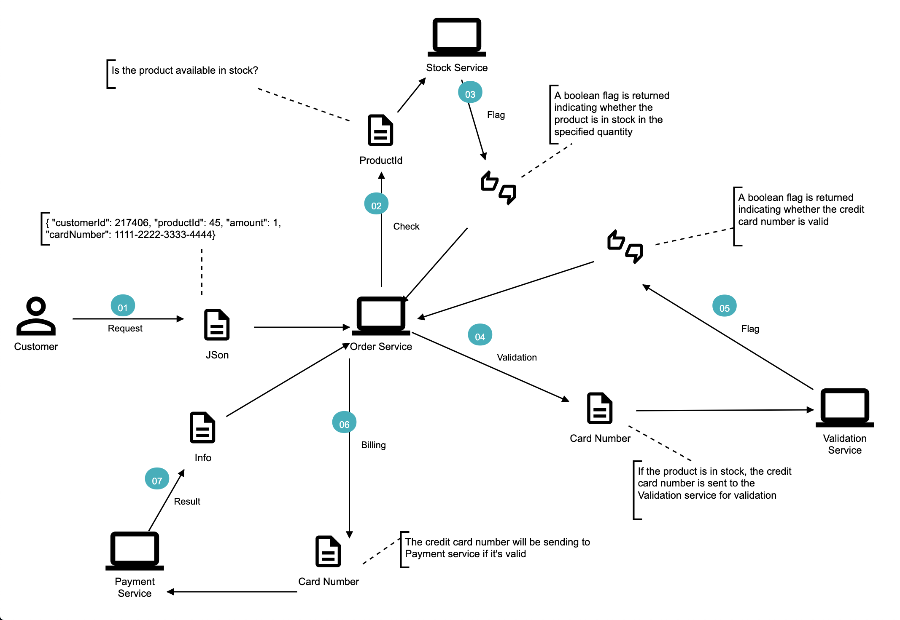
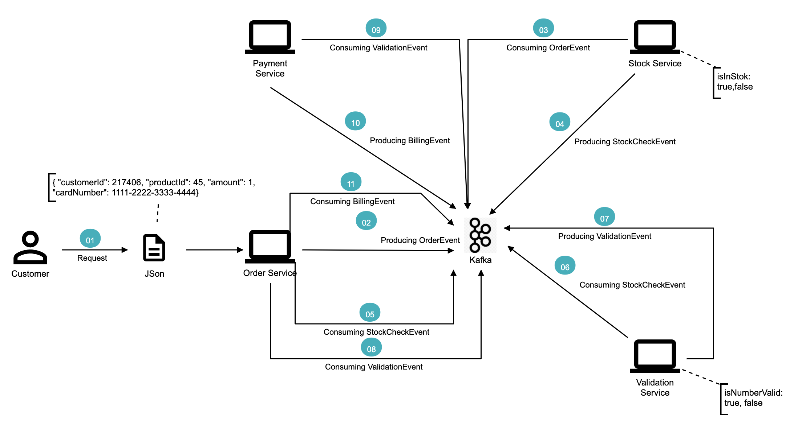

# Communication Between Microservices with Apache Kafka

This repository is a tutorial for `JUG Istanbul`'s `Apache Kafka` [meetup](https://www.meetup.com/Istanbul-Java-User-Group/events/272526880/) that showing how `Apache Kafka` can be used in inter-microservices communication. The example in this branch doesn't use `Kafka` and the value stream of the microservice architecture is shown below.

Our goal is to achieve the following lean architecture by using `Kafka`.

You can find the implementation of the above architecture at the [kafka](https://github.com/hakdogan/kafka-with-microservices/tree/kafka) branch.